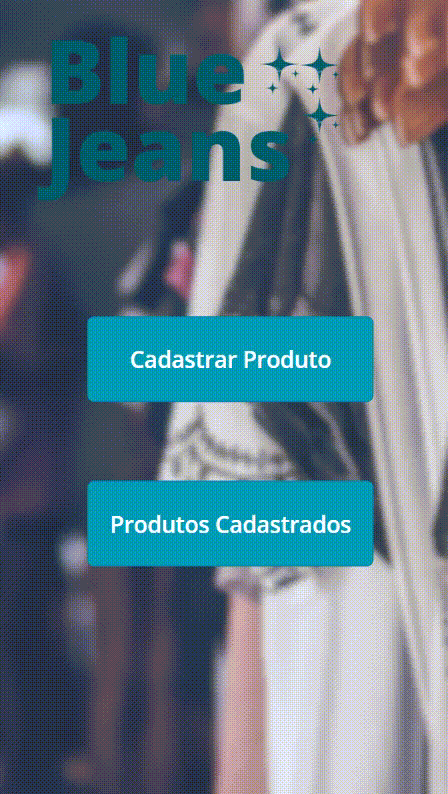

<h1>🧑🏻‍💻 Criando um App com Power Apps: BlueJeans Clothing Store 📱 </h1>

<a href="https://github.com/lucasmarcuzo/App-BlueJeans-Clothing-Store/">

 
 

## 🛠 Tecnologias utilizadas:

## 📱 Contato:

    
      
      
    
    
    
   

## 📃Licença:

Este projeto é licenciado sob a licença:

 <h3> - Obrigado pela visita! ✌🏻 </h3> 
 

  </h3>

